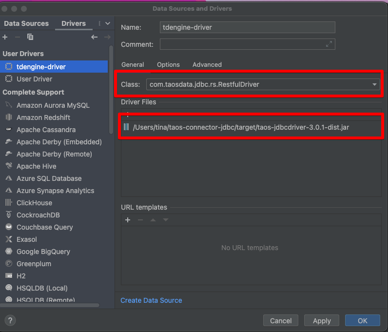

### 测试tdengine的rest api是否可访问
```shell
curl -u root:taosdata -d "show databases" localhost:6041/rest/sql
```

### 使用如下命令可以在该容器中执行TDengine的客户端taos对TDengine进行访问
```shell
docker exec -it tdengine_tdengine_1 taos
docker exec -it tdengine bash

taos> show databases;
              name              |
=================================
 information_schema             |
 performance_schema             |
Query OK, 2 rows in database (0.033802s)
```

### 如何使用客户端(如Datagrip)查看tdengine
#### 源码编译JDBC-Connector
* git clone https://github.com/taosdata/taos-connector-jdbc.git -b $version
* 在taos-connector-jdbc目录下执行 
  ```shell
   # 若mac未安装mvn, 直接brew install mvn
   mvn clean package -Dmaven.test.skip=true
  ```
#### 使用IDEA database连接TDengine
  * 在IDE的驱动中添加`taos-connector-jdbc`-> `target`文件夹下的`taos-jdbcdriver-3.0.1-dist.jar`
    * 选择restful方式进行连接
      
      
      


    ⚠️ 注意说明
    1. 注意图03的URL格式
    2. 坑点记录 
       mac电脑上无法运行linux的应用程序， 所以无法安装成功tdengine-client端， 所以mac上暂时使用restful方式

#### 修改taos密码
* 进入容器执行taos
  * alter user root pass 'tttttt';
  * 注意, 修改过密码后, taos登陆脚本如下
  ```shell
   taos -uroot -p<PWD>
   ex:
   taos -uroot -p666666
  ```


